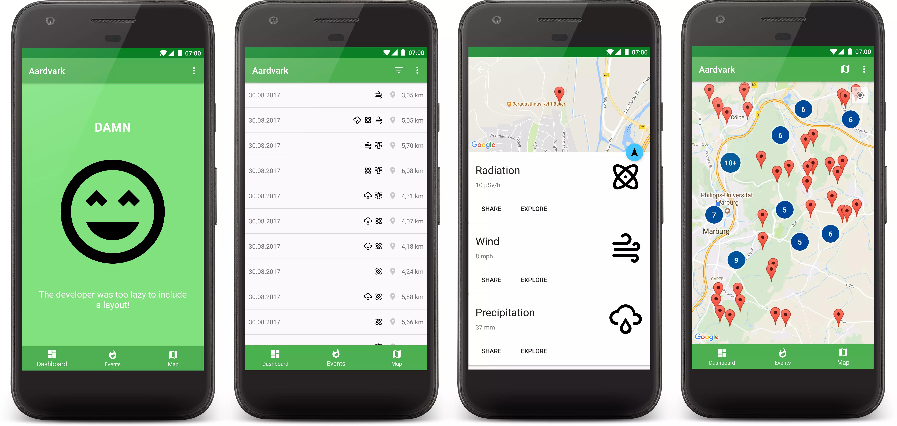

# Aardvark

### Features
- Dashboard
  - Not yet implemented
  - Will be used to show an overview of all events
    - Nearby events
    - Dangerous events (measurement above certain threshold)
    - Types of events (measurement types)
- List of events
  - Shows all events
  - Shows distance to current position if lastLocation tracking permission is granted
  - Filter or sort events by
    - Distance
    - Measurements
    - Time
  - Navigate to an event via Google Maps Navigation
- Map
  - See all events
  - Clusters nearby events
  - Chose between different map types
    - Hybrid
    - None
    - Normal
    - Satellite
    - Terrain

### Plugins

| Library | Version |
| --- | --- |
| Android Maps Utils | 0.5.0 |
| Crashlytics | 2.6.8 |
| Firebase<ul><li>Firebase Core</li></ul> | 11.4.0 |
| Google Play Services<ul><li>Location</li><li>Maps</li></ul> | 11.4.0 |
| KAU | 3.4.3 |
| LeakCanary | 1.5.4 |
| Markwon | 1.0.0 |
| Moshi | 1.5.0 |
| OkHttp | 3.9.0 |
| Support Libraries<ul><li>Constraint Layout 1.0.2</li><li>Design Support Library</li><li>v4 Support Libraries</li><li>v7 appcompat library</li><li>v7 cardview library</li><li>v7 Preference Support Library</li><li>v7 recyclerview library</li><li>v14 Preference Support Library</li><li>Vector Drawable Library</li></ul> | 26.1.0 |